# mcp-frontend-perf

A frontend performance anti-patterns demo showcasing AI-powered root cause analysis using Claude Code with MCP (Model Context Protocol) servers for browser automation.

## Overview

This project demonstrates how AI can automatically detect, analyze, and diagnose web performance issues by connecting directly to browser DevTools. It includes intentionally "bad" performance demos that trigger real Core Web Vitals warnings.

**Key Features:**
- 22 live performance anti-pattern demos (LCP, CLS, INP, Layout Thrashing, etc.)
- AI-powered root cause analysis via MCP browser tools
- Automated performance tracing and insights extraction
- Real DevTools metrics, not simulations
- Copy-paste prompts for Claude Code on every demo

## Two Ways to Use This

### Option 1: Interactive Exploration (No Setup)

Visit the live demo: **https://starman69.github.io/mcp-frontend-perf/**

- Browse any demo and trigger anti-patterns manually
- Open DevTools (`F12`) to see performance issues
- Great for learning without any installation

### Option 2: Run Locally with AI Agent (Recommended)

Clone and run locally to enable Claude Code integration:

- AI can read and analyze the source code directly
- Full MCP browser automation support
- Get detailed root cause analysis with file/line references

See [Setup](#setup) below for local installation.

## MCP Browser Architecture

```mermaid
flowchart LR
    subgraph agent["🤖 Coding Agent"]
        A["Claude Code<br/>Copilot<br/>Cursor<br/>etc."]
    end

    subgraph mcp["🔌 MCP Servers"]
        direction TB
        P["<b>Playwright MCP</b><br/>Navigation • Clicks<br/>Typing • Screenshots"]
        D["<b>Chrome DevTools MCP</b><br/>Performance Traces<br/>Network • Console"]
    end

    subgraph browser["🌐 Chrome Canary"]
        B["Browser Instance<br/><i>--remote-debugging-port=9222</i>"]
        APP["Demo App<br/>localhost:5173"]
    end

    A -->|stdio| P
    A -->|stdio| D
    P -->|CDP| B
    D -->|CDP| B
    B --> APP

    style agent fill:#e0f2fe,stroke:#0ea5e9,stroke-width:2px,color:#0c4a6e
    style mcp fill:#fef9c3,stroke:#eab308,stroke-width:2px,color:#713f12
    style browser fill:#dcfce7,stroke:#22c55e,stroke-width:2px,color:#14532d

    style A fill:#f1f5f9,stroke:#94a3b8,stroke-width:1px,color:#334155
    style P fill:#fefce8,stroke:#a3a3a3,stroke-width:1px,color:#1f2937
    style D fill:#fefce8,stroke:#a3a3a3,stroke-width:1px,color:#1f2937
    style B fill:#f0fdf4,stroke:#94a3b8,stroke-width:1px,color:#1f2937
    style APP fill:#ffffff,stroke:#94a3b8,stroke-width:1px,color:#1f2937
```



**How it works:**
| Layer | Protocol | Purpose |
|-------|----------|---------|
| Agent ↔ MCP | stdio | JSON-RPC tool calls |
| MCP ↔ Browser | CDP | Chrome DevTools Protocol commands |

Both MCP servers connect to the same Chrome instance, enabling:
- **Performance traces** - Record and analyze Core Web Vitals
- **DOM interaction** - Click, type, scroll, screenshot
- **Network monitoring** - Request waterfall, timing, headers
- **Console capture** - Errors, warnings, React messages

## Why Chrome Canary?

We use **Chrome Canary** as the target browser because:

- **Isolated from daily browsing** - Doesn't affect your main Chrome or Edge profiles
- **Run simultaneously** - Use Canary for testing while keeping Chrome/Edge open for work
- **Latest DevTools features** - Access to newest performance insights
- **Separate user data** - Fresh profile without extensions interfering

## Setup

### Prerequisites

- **Node.js 18+** (recommended: Node 20 LTS) - [Download](https://nodejs.org/)
- **Chrome Canary** - [Download](https://www.google.com/chrome/canary/)

### 1. Clone and Install

```bash
git clone https://github.com/starman69/mcp-frontend-perf.git
cd mcp-frontend-perf
npm install
```

### 2. Start the Demo App

```bash
npm run dev
```

The app runs at `http://localhost:5173` (Vite will use the next available port if busy).

### 3. Launch Chrome Canary with Remote Debugging

Open a new terminal and run:

```bash
# macOS
/Applications/Google\ Chrome\ Canary.app/Contents/MacOS/Google\ Chrome\ Canary --remote-debugging-port=9222

# Windows (replace <USER> with your username)
"C:\Users\<USER>\AppData\Local\Google\Chrome SxS\Application\chrome.exe" --remote-debugging-port=9222

# Linux
google-chrome-canary --remote-debugging-port=9222
```

### 4. Configure MCP Servers

Create a `.mcp.json` file in the project root (recommended for project-specific config):

```json
{
  "mcpServers": {
    "playwright": {
      "type": "stdio",
      "command": "npx",
      "args": ["@playwright/mcp@latest", "--cdp-endpoint=http://127.0.0.1:9222"],
      "env": {}
    },
    "chrome-devtools": {
      "type": "stdio",
      "command": "npx",
      "args": ["-y", "chrome-devtools-mcp@latest", "--browser-url=http://127.0.0.1:9222"],
      "env": {}
    }
  }
}
```

Alternatively, add to your global `~/.claude.json` if you want these MCP servers available across all projects.

### 5. Run Claude Code

```bash
cd mcp-frontend-perf
claude
```

At startup, Claude Code automatically reads `CLAUDE.md` which contains:
- Demo route mappings (so you can say "go to the CLS demo" without URLs)
- MCP tool selection guidance (which tool to use for each task type)
- Common analysis patterns for each performance issue type
- Source code locations for root cause reporting

Now you can ask Claude to analyze any demo by name:
```
Go to the layout thrashing demo and analyze what's causing forced reflows
```

## Performance Anti-Patterns Included

Each demo includes:
- **Problem** - What causes the issue
- **DevTools Detection** - How to find it manually
- **MCP Automation** - Playwright for interaction, Chrome DevTools for metrics
- **Coding Agent Prompt** - Copy-paste prompt for AI analysis

| Demo | Core Web Vital | What It Demonstrates |
|------|---------------|---------------------|
| **Render Blocking** | FCP | Synchronous scripts blocking paint |
| **Large Bundle** | FCP | Unoptimized JavaScript bundles |
| **Missing Resource Hints** | LCP | No preload/preconnect |
| **LCP** | LCP | Delayed hero image, chained API calls |
| **Unoptimized Images** | LCP | Large, uncompressed images |
| **Font Loading** | CLS/FCP | FOUT/FOIT flash issues |
| **CLS** | CLS | Late-injecting ads, images without dimensions |
| **INP** | INP | Slow event handlers blocking interaction |
| **Long Tasks** | INP | Main thread blocking >50ms |
| **Layout Thrashing** | - | Forced synchronous layouts from read/write interleaving |
| **Animation Jank** | - | Non-composited animations |
| **Excessive Re-renders** | - | React re-render storms |
| **Waterfall Requests** | - | Chained network dependencies |
| **Third Party Scripts** | - | Heavy external script impact |
| **Memory Leaks** | - | Detached DOM nodes, event listener leaks |
| **Excessive DOM** | - | 10,000+ DOM nodes |
| **Inline Functions** | - | Functions breaking React.memo optimization |
| **useEffect Issues** | - | Missing dependencies, over-fetching |
| **Scroll Jank** | - | Non-passive scroll listeners, heavy handlers |
| **Suspense Waterfall** | - | Nested lazy loading creating request chains |
| **Hydration Mismatch** | - | Server/client HTML differences |
| **Missing Keys** | - | React list rendering without unique keys |

## Using AI for Root Cause Analysis

### Example: Analyzing Layout Thrashing

```
You: "Go to the layout thrashing demo, record a performance trace while
      scrolling, and tell me what's causing the forced reflows"
```

The AI will:
1. Navigate to the page (using route from CLAUDE.md)
2. Start a performance trace
3. Trigger scrolling via browser automation
4. Stop the trace and analyze insights
5. Report the exact function and line causing forced reflows

### Example: Diagnosing Bad LCP

```
You: "Load the LCP demo with a performance trace and break down
      what's contributing to the slow LCP time"
```

The AI will:
1. Start trace with page reload
2. Wait for LCP element to load
3. Analyze LCP breakdown (TTFB, load delay, render delay)
4. Identify missing optimizations (preload hints, fetchpriority)

### Example: CLS Analysis

```
You: "Go to the CLS demo, trigger the layout shifts, and tell me
      what's causing the bad CLS score"
```

The AI will:
1. Navigate and take initial snapshot
2. Start performance trace
3. Click the trigger button
4. Analyze CLSCulprits insight
5. Report each layout shift with timing and score

## MCP Tools Available

### Chrome DevTools MCP

| Tool | Purpose |
|------|---------|
| `performance_start_trace` | Begin recording performance trace |
| `performance_stop_trace` | Stop recording, get metrics and insights |
| `performance_analyze_insight` | Deep dive into specific insight |
| `take_snapshot` | Capture accessibility tree snapshot |
| `take_screenshot` | Capture visual screenshot |
| `list_network_requests` | View all network activity |
| `list_console_messages` | View console output |
| `evaluate_script` | Run JavaScript in page context |
| `click` / `fill` / `hover` | Interact with page elements |

### Playwright MCP

| Tool | Purpose |
|------|---------|
| `browser_navigate` | Navigate to URL |
| `browser_snapshot` | Capture page state |
| `browser_click` | Click elements |
| `browser_type` | Type into inputs |
| `browser_evaluate` | Execute JavaScript |
| `browser_take_screenshot` | Capture screenshots |

## When to Use Which MCP

| Use Case | Better Tool |
|----------|-------------|
| Deep performance analysis | Chrome DevTools MCP |
| Performance insights (LCP, CLS, ForcedReflow) | Chrome DevTools MCP |
| Memory profiling | Chrome DevTools MCP |
| Cross-browser testing | Playwright MCP |
| Headless automation | Playwright MCP |
| CI/CD pipelines | Playwright MCP |
| Connecting to existing browser | Chrome DevTools MCP |

## Example Session

```bash
# Terminal 1: Start the demo app
cd mcp-frontend-perf
npm run dev

# Terminal 2: Start Chrome Canary with remote debugging
google-chrome-canary --remote-debugging-port=9222

# Terminal 3: Start Claude Code (from the project directory)
cd mcp-frontend-perf
claude

# In Claude Code, ask:
> "Go to the CLS demo, trigger the layout shifts, and analyze the CLS score"
```

> **Note:** Claude Code reads `CLAUDE.md` at startup, which maps demo names to routes. You can reference demos by name (e.g., "CLS demo", "layout thrashing demo") without specifying URLs.

## Sample Analysis Output

When the AI analyzes the Layout Thrashing demo, you get results like:

```
Performance Analysis: Layout Thrashing Demo

Total Forced Reflow Time: 721 ms

Root Cause: onScroll @ BadReflowList.jsx:13

Call frames causing reflow:
- Line 17:28 - offsetHeight read: 327 ms
- Line 20:31 - offsetWidth read: 20 ms
- Line 22:26 - style.width write then read: 374 ms

Problem: Interleaved DOM reads/writes in scroll handler
Fix: Batch all reads first, then batch all writes
```

## Tech Stack

- **React 19** + **TypeScript**
- **Vite** for dev server
- **Tailwind CSS v4** for styling
- **React Router** for navigation

## License

MIT
